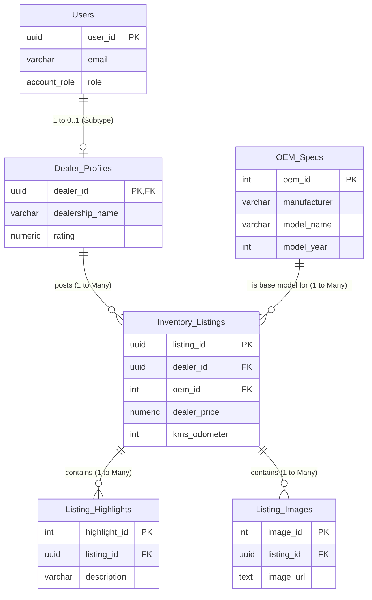

#  BUYC Corp - Dealership Marketplace Platform

A modern, full-stack web application designed for second-hand car dealerships to manage their inventory, reference official OEM specifications, and publish marketplace listings.

This repository demonstrates the complete software development lifecycle across three distinct phases: Frontend UI Design, Relational Database Architecture, and Backend API Integration.

---

##  Tech Stack & Architecture

* **Frontend:** React.js, Vite, Tailwind CSS, React Router DOM
* **Backend:** Node.js, Express.js, CORS
* **Database:** PostgreSQL (Hosted via Neon.tech), `pg` driver
* **Architecture:** RESTful API, Normalized Relational Database (3NF)

---

##  Project Progression & Milestones

### ✅ Phase I: Frontend User Interface (`/frontend`)
Developed a Single Page Application (SPA) focusing on SaaS design principles.
* **Dealer Dashboard:** Features a CSS-grid layout displaying current inventory, complete with dynamic filtering (Price, Color, Mileage) and bulk-deletion capabilities.
* **Listing Management:** Built a split-column form for dealers to input new vehicles, highlight specifications, and upload images.
* **UI/UX:** Implemented sticky navigation, elevated soft-shadow cards, and a unified branding theme using Tailwind CSS.


### ✅ Phase II: Enterprise Database Engineering (`/backend/db`)
Architected a highly normalized, production-ready PostgreSQL database to handle users, manufacturer data, and dealer inventory.
* **Data Normalization:** Extracted listing highlights and images into child tables (1-to-N relationships) to prevent array search bottlenecks.
* **Security & Integrity:** Replaced sequential IDs with UUIDs (`gen_random_uuid()`) to prevent enumeration attacks. Utilized ENUMs (`account_role`, `vehicle_status`) and strict `CHECK` constraints to ensure data validity at the database level.
* **Performance:** Implemented B-Tree indexing on highly queried columns (e.g., price, manufacturer).


### ✅ Phase III: Backend REST APIs (`/backend`)
Built a robust Express.js server to bridge the React frontend with the PostgreSQL database.
* **Database Connection:** Integrated with a live Neon.tech serverless PostgreSQL database using connection pooling.
* **Endpoints Built:**
  * `GET /api/oem/count`: Calculates and returns the total number of official OEM models available in the system.
  * `GET /api/oem/search`: A dynamic search endpoint allowing query parameters (e.g., `?model_name=City&year=2015`) to filter the OEM catalog using parameterized SQL queries.


---

## 📁 Repository Structure

```text
buyccorp/
├── frontend/               # React SPA Application
│   ├── src/                # Components and Pages
│   ├── package.json        
│   └── README.md           # Frontend-specific documentation
├── backend/                # Node.js / Express Server
│   ├── db/                 
│   │   ├── schema.sql      # Database architecture
│   │   ├── seed.sql        # Dummy data generation
│   │   └── architecture.md # High-level database concepts and ERD
│   ├── server.js           # Express API endpoints
│   ├── .env.example        # Environment variables template
│   └── package.json        
└── README.md               # Root documentation

```

## 📁 Schema design
To visualize how the data flows and links together, here is the schema's relationship structure:


